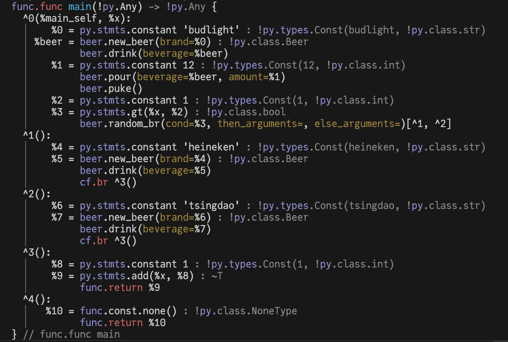

# Kirin

Kirin is the **K**ernel **I**ntermediate **R**epresentation **In**frastructure. It is a compiler
infrastructure for building compilers for embedded domain-specific languages (eDSLs) that target
scientific computing kernels.

## Features

- MLIR-like dialects as composable python packages
- Generated Python frontend for your DSLs
- Pythonic API for building compiler passes
- Julia-like abstract interpretation framework
- Builtin support for interpretation
- Builtin support Python type system and type inference
- Type hinted via modern Python type hints

## Kirin's mission

Compiler toolchain for scientists. Scientists are building domain-specific languages (DSLs) for
scientific purposes. Most scientists do not have any compiler engineering background. On the other hand,
these DSLs are often high-level, and their instructions are usually slower than the low-level instructions
and thus result in smaller programs. No need to generate high quality LLVM IR/native binary most of the time!
So there are some chances to simplify terminologies, interfaces for the none-pros, while allowing good
interactivity and fast prototyping.

For the interested, please read the [Kirin's Mission](blog/2024/11/11/kirins-mission/) blog post for more details.

## Acknowledgement

While the mission and audience may be very different, Kirin has been deeply inspired by a few projects:

- [MLIR](https://mlir.llvm.org/), the concept of dialects and the way it is designed.
- [xDSL](https://github.com/xdslproject/xdsl), about how IR data structure & interpreter should be designed in Python.
- [Julia](https://julialang.org/), abstract interpretation, and certain design choices for scientific community.
- [JAX](https://jax.readthedocs.io/en/latest/) and [numba](https://numba.pydata.org/), the frontend syntax and the way it is designed.
- [Symbolics.jl](https://github.com/JuliaSymbolics/Symbolics.jl) and its predecessors, the design of rule-based rewriter.

## Quick Example: the `beer` language

In this example, we will mutate python's semantics to
support a small eDSL (embedded domain-specific language) called `beer`.
It describes the process of brewing, pour, drink beers and get drunk.

Before we start, let's take a look at what would our `beer` language look like:

```python
@beer
def main(x: int):
    beer = NewBeer(brand="budlight") # (1)!
    pints = Pour(beer, x) # (2)!
    Drink(pints) # (3)!
    Puke() # (4)!

    return x + 1 # (5)!
```

1. The `NewBeer` statement creates a new beer object with a given brand.
2. The `Pour` statement pours a beer for `x` portions into pints object.
3. The `Drink` statement drinks pints object.
4. The `Puke` statement pukes. Now we are drunk!
5. Doing some math to get a result.

The beer language is wrapped with a decorator `@beer` to indicate that the function is written in the `beer` language instead of normal Python. (think about how would you program GPU kernels in Python, or how would you use `jax.jit` and `numba.jit` decorators).

You can run the `main` function as if it is a normal Python function.

```python
main(1)
```

or you can inspect the compile result via

```python
main.print()
```




### Defining the dialect
First, let's define the [dialect](def.md#dialects) object, which is a registry for all
the objects modeling the semantics.

```python
from kirin import ir

dialect = ir.Dialect("beer")
```

### Defining the statements

Next, we want to define a runtime value `Beer`, as well as the runtime value of `Pints` for the `beer` language so that we may use
later in our interpreter. These are just a standard Python `dataclass`.

```python
from dataclasses import dataclass

@dataclass
class Beer:
    brand: str

@dataclass
class Pints:
    kind: Beer
    amount: int
```

Now, we can define the `beer` language's [statements](def.md#statements).

```python
from kirin.decl import statement, info
from kirin import ir, types

@statement(dialect=dialect)
class NewBeer(ir.Statement):
    name = "new_beer" # (1)!
    traits = frozenset({ir.Pure(), ir.FromPythonCall()}) # (2)!
    brand: str = info.attribute(types.String) # (3)!
    result: ir.ResultValue = info.result(types.PyClass(Beer)) # (4)!
```

1. The `name` field specifies the name of the statement in the IR text format (e.g printing).
2. The `traits` field specifies the statement's traits, in this case, it is a
   [pure function](101.md/#what-is-purity) because each brand name uniquely identifies a
   beer object. We also add a trait of `FromPythonCall()` to allow lowering from python ast.
3. The `brand` field specifies the argument of the statement. It is an Attribute of string value. See [`PyAttr`][kirin.ir.PyAttr] for further details.
4. The `result` field specifies the result of the statement. Usually a statement only has one result
   value. The type of the result must be [`ir.ResultValue`](def.md#ssa-values) with a field specifier
    `info.result` that optionally specifies the type of the result.

the `NewBeer` statement creates a new beer object with a given brand. Thus
it takes a string as an attribute and returns a `Beer` object. Click the plus sign above
to see the corresponding explanation.


```python
@statement(dialect=dialect)
class Pour(ir.Statement):
    traits = frozenset({ir.FromPythonCall()})
    beverage: ir.SSAValue = info.argument(types.PyClass(Beer))# (1)!
    amount: ir.SSAValue = info.argument(types.Int)
    result: ir.ResultValue = info.result(types.PyClass(Pints))
```

1. The arguments of a [`Statement`](def.md#statements) must be [`ir.SSAValue`](def.md#ssa-values) objects with a
   field specifier `info.argument` that optionally specifies the type of the argument.

Next, we define `Pour` statement that takes a `Beer` object as an argument, and the result value is a `Pints` object. The `types.PyClass` type understands Python classes and can take a Python class as an argument to create a type attribute [`TypeAttribute`](def.md#attributes).


```python
@statement(dialect=dialect)
class Drink(ir.Statement):
    traits = frozenset({ir.FromPythonCall()})
    pints: ir.SSAValue = info.argument(types.PyClass(Pints))
```

Similarly, we define `Drink` statement that takes a `Pints` object as an argument. As the same previously, the `types.PyClass` type understands Python classes (in this case Pints class) and can take a Python class as an argument to create a type attribute. Notice that drink does not have any return value.

Finally, we define `Puke` statement that describe the puke action, which does not have any arguments and no return value.

```python
@statement(dialect=dialect)
class Puke(ir.Statement):
    traits = frozenset({ir.FromPythonCall()})
```


### Defining the method table for concrete interpreter

Now with the statements defined, we can define how to interpret them by defining the method table associate with each statement.

```python
from kirin.interp import Frame, Successor, Interpreter, MethodTable, impl

@dialect.register
class BeerMethods(MethodTable):
    ...

```

The `BeerMethods` class is a subclass of `MethodTable`. Together with the decorator from the dialect group `dialect.register`, they registers the implementation  method table to interpreter. The implementation is a method decorated with `@impl` that executes the
statement.

```python
    @impl(NewBeer)
    def new_beer(self, interp: Interpreter, frame: Frame, stmt: NewBeer):
        return (Beer(stmt.brand),) # (1)!

    @impl(Drink)
    def drink(self, interp: Interpreter, frame: Frame, stmt: Drink):
        pints: Pints = frame.get(stmt.pints)
        print(f"Drinking {pints.amount} pints of {pints.kind.brand}")
        return ()

    @impl(Pour)
    def pour(self, interp: Interpreter, frame: Frame, stmt: Pour): # (2)!
        beer: Beer = frame.get(stmt.beverage)
        amount: int = frame.get(stmt.amount)
        print(f"Pouring {beer.brand} {amount}")

        return (Pints(beer, amount),)

    @impl(Puke)
    def puke(self, interp: Interpreter, frame: Frame, stmt: Puke):
        print("Puking!!!")
        return () # (3)!
```

1. The statement has return value which is a `Beer` runtime object.
2. Sometimes, the execution of a statement will have *side-effect* and return value.
For example, here the execution `Pour` statement print strings (side-effect) as well as return a `Pints` runtime object.
3. In the case where the statement does not have any return value but simply have side-effect only, the return value is simply an empty tuple.

The return value is just a normal tuple that contain interpretation runtime values. Click the plus sign above
to see the corresponding explanation.


### Rewrite `Drink` statement

Sometimes when we are drunk, we will do something that is not expected. Here, we introduce how to do rewrite on the program.
What we want to do is simple:

Everytime we drink, we will to buy yet another new beer and also puke. Sounds like a drunk person will do huh.


More specifically, we want to rewrite the program such that, everytime we encounter a `Drink` statement, we insert a `NewBeer` statement, and `Puke` after `Drink`.
Let's define a rewrite pass that rewrite our `Drink` statement. This is done by defining a subclass of [`RewriteRule`][kirin.rewrite.RewriteRule] and implementing the
`rewrite_Statement` method. The `RewriteRule` class is a standard Python visitor on Kirin's IR.


```python
from kirin.rewrite import RewriteResult, RewriteRule # (1)!
from kirin import ir

@dataclass
class NewBeerAndPukeOnDrink(RewriteRule):
    # sometimes someone get drunk, so they keep getting new beer and puke after they drink
    def rewrite_Statement(self, node: ir.Statement) -> RewriteResult: # (2)!
        if not isinstance(node, Drink): # (3)!
            return RewriteResult()

        # 1. create new stmts:
        new_beer_stmt = NewBeer(brand="saporo") # (4)!
        puke_stmt = Puke() # (5)!

        # 2. put them in the ir
        new_beer_stmt.insert_after(node) # (6)!
        puke_stmt.insert_after(new_beer_stmt)

        return RewriteResult(has_done_something=True) # (7)!
```

1. Import the `RewriteRule` class from the `rewrite` module.
2. This is the signature of `rewrite_Statement` method. Your IDE should hint you the type signature so you can auto-complete it.
3. Check if the statement is a `Drink` statement. If it is not, return an empty `RewriteResult`.
4. Create new `NewBeer` statement.
5. Create new `Puke` statement.
6. insert the new created statements into the IR. Each of the ir.Statement provides API such as [`insert_after`][kirin.ir.Statement.insert_after], [`insert_before`][kirin.ir.Statement.insert_after] and [`replace_by`][kirin.ir.Statement.replace_by] that allow you to insert a new statement either after or before, or repalce the current statement with another one.
7. Return a `RewriteResult` that indicates the rewrite has been done.


### Putting everything together

Now we can put everything together and finally create the `beer` decorator, and
you do not need to figure out the complicated type hinting and decorator implementation
because Kirin will do it for you!

```python
from kirin.ir import dialect_group
from kirin.prelude import basic_no_opt
from kirin.rewrite import Walk

@dialect_group(basic_no_opt.add(dialect)) # (1)!
def beer(self): # (2)!

    # some initialization if you need it
    def run_pass(mt, drunk:bool=True): # (3)!

        if drunk:
            Walk(NewBeerAndPukeOnDrink()).rewrite(mt.code) # (4)!

    return run_pass # (5)!
```

1. The [`dialect_group`][kirin.ir.group.dialect_group] decorator specifies the dialect group that the `beer` dialect belongs to. In this case, instead of rebuilding the whole dialect group, we just add our `dialect` object to the [`basic_no_opt`][kirin.prelude.basic_no_opt] dialect group which provides all the basic Python semantics, such as math, function, closure, control flows, etc.
2. The `beer` function is the decorator that will be used to decorate the `main` function.
3. The `run_pass` function wraps all the passes that need to run on the input method. It optionally can take some arguments or keyword arguments that will be passed to the `beer` decorator.
4. Inside the `run_pass` function, we will traverse the entire IR and use the rule `NewBeerAndPukeOnDrink` to rewrite all the `Drink` statements.
5. Remember to return the `run_pass` function at the end of the `beer` function.

This is it!

For further advanced use case see [`CookBook/Beer`](cookbook/beer_dialect/control_flow_rewrite.md)

## License

Apache License 2.0 with LLVM Exceptions
